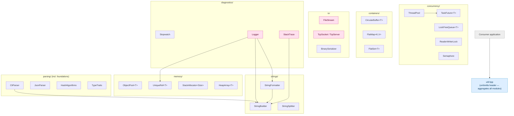

# C4 Component Diagram — `egl-util-cpp`

This is the **C4 model Level 3 (Component)** view of the library: it groups the 25 public
components into their seven modules (spec §4) and draws the **actual** internal dependency
edges (extracted from the `#include` graph, not aspirational ones). It complements the ASCII
module tree in [`docs/specs/01_spec_util.md`](../specs/01_spec_util.md) §4.

## Level 2 (Container) context

The library is a single **container** a consumer application links, shipped as two CMake
targets over one source tree ([ADR-0004](../adr/0004-adopt-hybrid-header-only-plus-static-build-model.md)):

- `egl-util::egl-util` — **INTERFACE** (header-only), the default, zero link dependencies.
- `egl-util::egl-util-static` — **STATIC** superset that also compiles the OS-API-heavy tier
  (`FileStream`, `TcpSocket`/`TcpServer`, `StackTrace`, the async `Logger`).

A consumer includes either the umbrella header `it/d4np/util/util.hpp` (aggregates every
module) or any single component header directly.

## Level 3 (Component) diagram

**Legend.** Pink components (`FileStream`, `TcpSocket`/`TcpServer`, `StackTrace`, `Logger`)
are the **compiled tier** (STATIC target); all others are header-only. Arrows point from a
component to the component it depends on (**A → B** means "A includes/uses B").

## Dependency rules (what the graph shows)

- **The graph is a DAG — no cycles, no back-edges into a "higher" layer.** It has three sinks
  (components depended upon but depending on nothing): `StringBuilder` (four in-edges),
  `TaskFuture`, and `UniqueRef`. Cross-module edges terminate in the `strings` foundation
  (`StringBuilder`/`StringFormatter`), the one exception being `Logger → UniqueRef`, which
  reaches into `memory`.
- **Only two intra-module edges exist:** `StringFormatter → StringBuilder` (the formatter renders
  through the builder, [ADR-0012](../adr/0012-string-formatter-compile-time-validation.md)) and
  `ThreadPool → TaskFuture` (the pool hands back futures,
  [ADR-0017](../adr/0017-thread-pool-priority-work-pool.md)).
- **Only three cross-module edges exist:** `CliParser → StringBuilder` (help text),
  `Logger → {StringFormatter, StringBuilder, UniqueRef}`
  ([ADR-0020](../adr/0020-logger-async-pump-with-strategy-sinks.md)), and
  `StackTrace → StringBuilder` (frame formatting,
  [ADR-0019](../adr/0019-stack-trace-compiled-tier-capture.md)).
- **`HashAlgorithms` and `TypeTraits` are pure foundations** — constexpr-only, and nothing in the
  library depends on them internally; they are provided for consumers. (They live under
  `parsing/` per spec §4 but were built first as Milestone 2 foundations.)
- **18 of the 25 components have zero internal dependencies** — the deliberately low coupling of a
  toolkit: `LockFreeQueue`, `Semaphore`, `ReaderWriterLock`, `TaskFuture`, all containers, all
  memory primitives, `StringSplitter`, `JsonParser`, `BinarySerializer`, `Stopwatch`, and
  `FileStream` each stand alone.
- **The compiled tier does not deepen the graph:** of the four compiled components, only `Logger`
  and `StackTrace` depend on anything (both on header-only `strings`/`memory`), so linking the
  STATIC target pulls in no surprise coupling.

## How this is kept honest

The edges above are mechanically derivable: re-run the internal-include scan over
`src/main/cpp/it/d4np/util/` and the arrow set must match this diagram. Any new cross-component
`#include` is a new edge here in the same PR — the diagram is part of the deliverable, not a
one-time snapshot.
